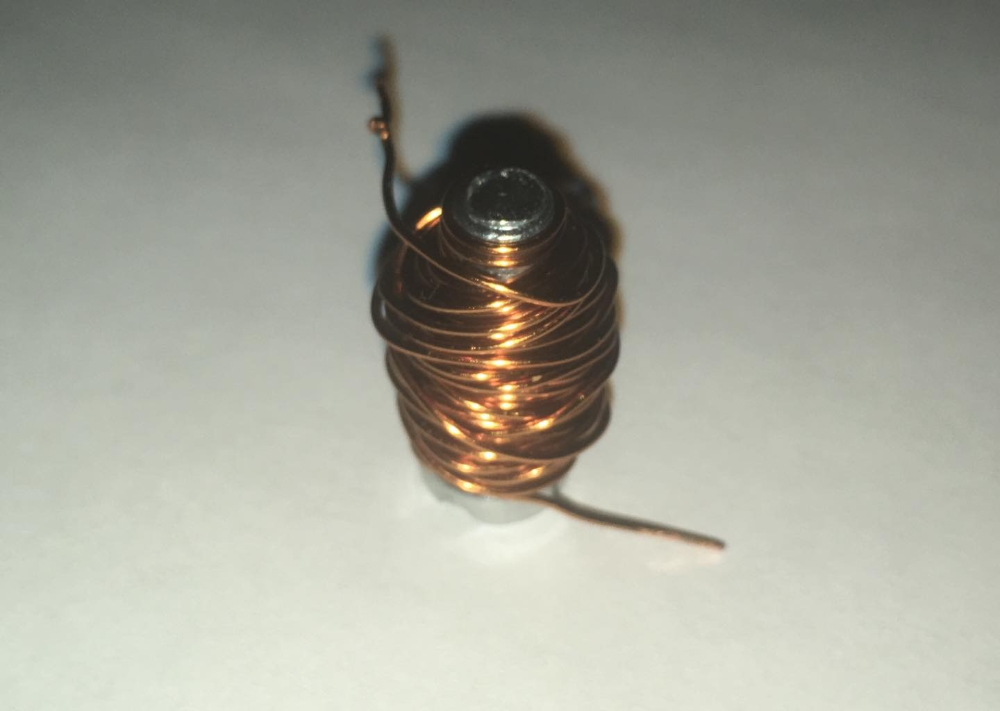
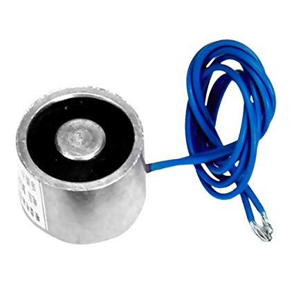

# Shallow Blue
## Description
Our group project is to create an autonomous chess board where a player can play against an AI. The project is targeted at people who have moderate experience in chess and can set up the board and interactive with the board.

## How to work in this repo
First you need to install Git in your computer :https://git-scm.com/downloads
After instalation, you will need to clone the repository in Github to your computer. For that you will need to create a folder that will be your workplace. In this folder, initialize the Git Bash, and use the command to clone this repository. Everytime that you work on the code, you will need to update your local repo using git pull, and every time that you finish working in your code, you will need to stage your modifications, commit the changes, and push the commit to the remote repo. Always trying to leave comments in your code, and updating the Readme with the developments. For Git Basics you can read here https://rogerdudler.github.io/git-guide/ or scroll down to the Git Basics section

## Project Development
### Requirements:

#### A:

- Be able to use electromagnets to move the pawns.
- Be able to use computer vision to detect that there are pieces on the board.
- Create custom chess pieces and chess board. 
- Implement an open source chess computer.
#### B:

- Be able to have the electromagnet move the different move sets.
- Be able to differentiate between the pieces with computer vision.
- Implement sounds to make the game more interactive.
- Implement visual effects to the game to make it more interactive.
- Create a user interface on a LCD screen on the board.
- Implement one difficulty on the chess computer.
#### C:

- Be able to have a fully autonomous player vs AI game of chess.
- Be able to detect the different pieces and track them during the game.
- Have different difficulty settings to choose from of the chess computer.
- Create a mobile application to have a live 2D screen of the game, move the pieces and have a game history.
- Be able to implement speech recognition for moving the pieces.
- Upgrade the interactive requirements from the B requirements.

### Electromagnets
At first we thought of creating our own electromagnets (see image bellow), but we realized that it would take more effort than needed, so we opted to use a 12V/ 3W electromagnet *off-the-shelf* (see image bellow). After some tests in 26/09 with the chosen electromagnet, we saw that some especifications must be attended for the proper operation of the system. Such as:
- The electromagnet must be at least 6mm of the piece.
- The board must be smooth so the piece doesn't suffer friction with it.
- The electromagnet must have some kind of cooling system, for it can overheat, and can create problems with the system as a whole, and also create a fire hazard.

|  |
|:--:|
|*Created Electromagnet*|

|  |
|:--:|
|*Off-the-shelf magnet*|

## Git Basics
Git is a distributed version control and source code management system.

It does this through a series of snapshots of your project, and it works with those snapshots to provide you with functionality to version and manage your source code.

### Versioning Concepts
What is version control?
Version control is a system that records changes to a file(s), over time.

- Centralized Versioning vs. Distributed Versioning
- Centralized version control focuses on synchronizing, tracking, and backing up files.
- Distributed version control focuses on sharing changes. Every change has a unique id.
- Distributed systems have no defined structure. You could easily have a SVN style, centralized system, with git.
- Additional Information

### Why Use Git?
- Can work offline.
- Collaborating with others is easy!
- Branching is easy!
- Branching is fast!
- Merging is easy!
- Git is fast.
- Git is flexible.
- Git Architecture
### Quick guide
https://rogerdudler.github.io/git-guide/

### Repository
A set of files, directories, historical records, commits, and heads. Imagine it as a source code data structure, with the attribute that each source code “element” gives you access to its revision history, among other things.

A git repository is comprised of the .git directory & working tree.

### .git Directory (component of repository)
The .git directory contains all the configurations, logs, branches, HEAD, and more. Detailed List.

### Working Tree (component of repository)
This is basically the directories and files in your repository. It is often referred to as your working directory.

### Index (component of .git dir)
The Index is the staging area in git. It’s basically a layer that separates your working tree from the Git repository. This gives developers more power over what gets sent to the Git repository.

### Commit
A git commit is a snapshot of a set of changes, or manipulations to your Working Tree. For example, if you added 5 files, and removed 2 others, these changes will be contained in a commit (or snapshot). This commit can then be pushed to other repositories, or not!

### Branch
A branch is essentially a pointer to the last commit you made. As you go on committing, this pointer will automatically update to point the latest commit.

### Tag
A tag is a mark on specific point in history. Typically people use this functionality to mark release points (v1.0, and so on)

### HEAD and head (component of .git dir)
HEAD is a pointer that points to the current branch. A repository only has 1 active HEAD. head is a pointer that points to any commit. A repository can have any number of heads.

### Stages of Git
Modified - Changes have been made to a file but file has not been committed to Git Database yet
Staged - Marks a modified file to go into your next commit snapshot
Committed - Files have been committed to the Git Database
Conceptual Resources
Git For Computer Scientists
Git For Designers
### Commands
init
Create an empty Git repository. The Git repository’s settings, stored information, and more is stored in a directory (a folder) named “.git”.

``$ git init``

To configure settings. Whether it be for the repository, the system itself, or global configurations ( global config file is ~/.gitconfig ).

 Print & Set Some Basic Config Variables (Global)
``$ git config --global user.email "MyEmail@Zoho.com"``
``$ git config --global user.name "My Name"``

To give you quick access to an extremely detailed guide of each command. Or to just give you a quick reminder of some semantics.

Quickly check available commands
``$ git help``

Check all available commands
``$ git help -a``

Command specific help - user manual
git help <command_here>
``$ git help add``
``$ git help commit``
``$ git help init``
or git <command_here> --help
``$ git add --help``
``$ git commit --help``
``$ git init --help``

add
To add files to the staging area/index. If you do not git add new files to the staging area/index, they will not be included in commits!

add a file in your current working directory
``$ git add HelloWorld.java``

add a file in a nested dir
``$ git add /path/to/file/HelloWorld.c``

Regular Expression support!
``$ git add ./*.java``

You can also add everything in your working directory to the staging area.
``$ git add -A``
This only adds a file to the staging area/index, it doesn’t commit it to the working directory/repo.

branch
Manage your branches. You can view, edit, create, delete branches using this command.

list existing branches & remotes
``$ git branch -a``

create a new branch
``$ git branch myNewBranch``

delete a branch
``$ git branch -d myBranch``

rename a branch
git branch -m <oldname> <newname>
``$ git branch -m myBranchName myNewBranchName``

edit a branch's description
``$ git branch myBranchName --edit-description``
checkout
Updates all files in the working tree to match the version in the index, or specified tree.

Checkout a repo - defaults to master branch
``$ git checkout``

Checkout a specified branch
``$ git checkout branchName``

Create a new branch & switch to it
equivalent to "git branch <name>; git checkout <name>"

``$ git checkout -b newBranch``
clone
Clones, or copies, an existing repository into a new directory. It also adds remote-tracking branches for each branch in the cloned repo, which allows you to push to a remote branch.

Clone learnxinyminutes-docs
``$ git clone https://github.com/adambard/learnxinyminutes-docs.git``

shallow clone - faster cloning that pulls only latest snapshot
``$ git clone --depth 1 https://github.com/adambard/learnxinyminutes-docs.git``

clone only a specific branch
``$ git clone -b master-cn https://github.com/adambard/learnxinyminutes-docs.git --single-branch``
commit
Stores the current contents of the index in a new “commit.” This commit contains the changes made and a message created by the user.

commit with a message
``$ git commit -m "Added multiplyNumbers() function to HelloWorld.c"``

signed commit with a message (user.signingkey must have been set
with your GPG key e.g. git config --global user.signingkey 5173AAD5)
``$ git commit -S -m "signed commit message"``

automatically stage modified or deleted files, except new files, and then commit
``$ git commit -a -m "Modified foo.php and removed bar.php"``

change last commit (this deletes previous commit with a fresh commit)
``$ git commit --amend -m "Correct message"``
log
Display commits to the repository.

Show all commits
``$ git log``

Show only commit message & ref
``$ git log --oneline``

Show merge commits only
``$ git log --merges``

Show all commits represented by an ASCII graph
``$ git log --graph``
merge
“Merge” in changes from external commits into the current branch.

Merge the specified branch into the current.
``$ git merge branchName``

Always generate a merge commit when merging
``$ git merge --no-ff branchName``
pull
Pulls from a repository and merges it with another branch.

Update your local repo, by merging in new changes
from the remote "origin" and "master" branch.
git pull <remote> <branch>

``$ git pull origin master``

By default, git pull will update your current branch
by merging in new changes from its remote-tracking branch
``$ git pull``

Merge in changes from remote branch and rebase
branch commits onto your local repo, like: "git fetch <remote> <branch>, git
rebase <remote>/<branch>"
  
``$ git pull origin master --rebase``
push
Push and merge changes from a branch to a remote & branch.

Push and merge changes from a local repo to a
remote named "origin" and "master" branch.
git push <remote> <branch>
  
``$ git push origin master``

By default, git push will push and merge changes from
the current branch to its remote-tracking branch
``$ git push``

To link up current local branch with a remote branch, add -u flag:
`` $ git push -u origin master ``
Now, anytime you want to push from that same local branch, use shortcut:
``$ git push``
